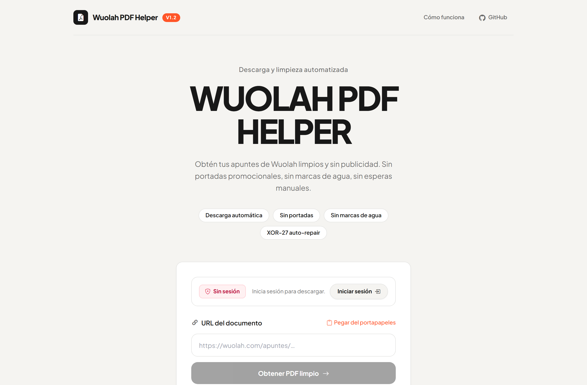
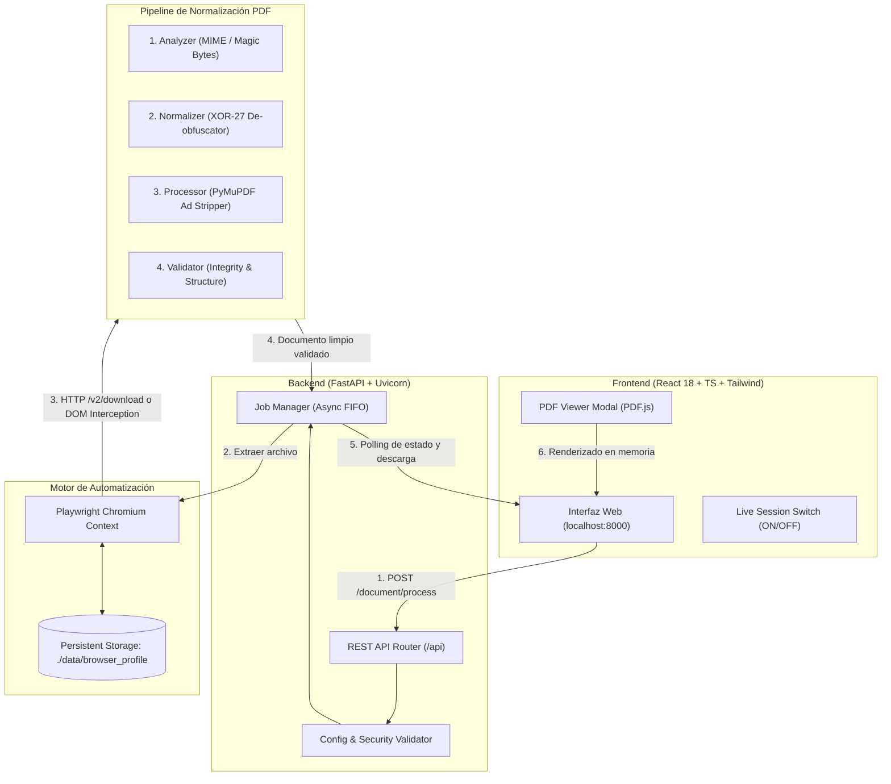
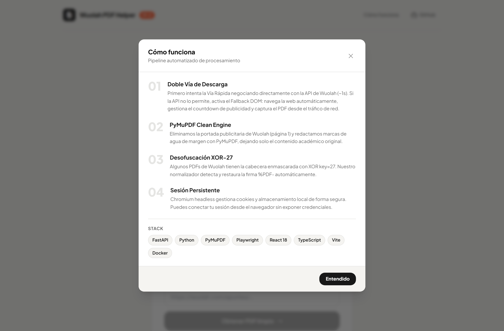

# Wuolah PDF Helper

<p align="center">
  
</p>

<p align="center">
  <strong>Herramienta de grado editorial para obtención, desofuscación XOR-27, limpieza de publicidad y entrega de documentos PDF de Wuolah.</strong>
</p>

<p align="center">
  <a href="https://github.com/alvarofrancogs/wuolah-pdf-helper/actions"></a>
  
  
  
  
  
  
  
  
</p>

<p align="center">
  
</p>

---

## 📑 Tabla de Contenidos

1. [Visión General](#1-visión-general)
2. [Características Destacadas](#2-características-destacadas)
3. [Arquitectura del Sistema](#3-arquitectura-del-sistema)
4. [Guía de Inicio Rápido (Usuario)](#4-guía-de-inicio-rápido-usuario)
   - [Opción A: Ejecución Local en Windows](#opción-a-ejecución-local-en-windows)
   - [Opción B: Despliegue en Docker Desktop (1-Click)](#opción-b-despliegue-en-docker-desktop-1-click)
5. [Guía de Uso Paso a Paso](#5-guía-de-uso-paso-a-paso)
   - [Paso 1: Inicio de sesión transparente en Chromium](#paso-1-inicio-de-sesión-transparente-en-chromium)
   - [Paso 2: Procesamiento y Limpieza de un PDF](#paso-2-procesamiento-y-limpieza-de-un-pdf)
   - [Paso 3: Visor integrado y descarga](#paso-3-visor-integrado-y-descarga)
   - [Paso 4: Cambio de cuenta](#paso-4-cambio-de-cuenta)
6. [El Pipeline PDF y la Desofuscación XOR-27](#6-el-pipeline-pdf-y-la-desofuscación-xor-27)
7. [Seguridad y Privacidad por Diseño](#7-seguridad-y-privacidad-por-diseño)
8. [Estructura del Repositorio](#8-estructura-del-repositorio)
9. [Referencia de la API REST](#9-referencia-de-la-api-rest)
10. [Configuración y Variables de Entorno](#10-configuración-y-variables-de-entorno)
11. [Ejecución de Pruebas Unitarias](#11-ejecución-de-pruebas-unitarias)
12. [Preguntas Frecuentes (FAQ)](#12-preguntas-frecuentes-faq)
13. [Licencia y Responsabilidad](#13-licencia-y-responsabilidad)

---

## 1. Visión General

**Wuolah PDF Helper** es una solución de ingeniería de software diseñada para estudiantes y académicos que necesitan acceder a sus apuntes y documentos universitarios de forma limpia y sin distracciones publicitarias.

La plataforma Wuolah implementa mecanismos de entrega complejos:
- Páginas intersticiales con temporizadores de cuenta atrás (~30-60 segundos).
- Modales recurrentes de suscripción y compra de saldo (*coins* o modalidad *Turbo*).
- **Envenenamiento de bytes:** Ofuscación a nivel binario mediante XOR con clave 27 (`0x1B`) sobre la cabecera de los archivos PDF para impedir su lectura en visores externos.
- Inserción de páginas completas de anuncios de marcas comerciales entre las páginas de contenido legítimo.

**Wuolah PDF Helper** automatiza y resuelve cada uno de estos retos de manera ética, manteniendo un contexto de navegador seguro, extrayendo el archivo original, reparando su estructura binaria y removiendo la publicidad inyectada para entregar un PDF estandarizado, ligero e impecable.

---

## 2. Características Destacadas

* ⚡ **Descarga Automatizada con Doble Vía:** El sistema intenta primero una **Vía Rápida** (~1s) negociando directamente con la API oficial de Wuolah. Si la API no lo permite, activa un **Fallback DOM Inteligente** que navega la web automáticamente, gestiona el countdown de publicidad (~30-60s) y captura el PDF desde el tráfico de red — sin intervención manual.
* 🛡️ **Fallback DOM Robusto:** Playwright interactúa con la página cerrando modales de suscripción, seleccionando la descarga gratuita con publicidad, reintentando clics automáticamente si la descarga no se inicia, y gestionando pestañas emergentes de anuncios.
* 🧩 **Desofuscación XOR-27:** Algoritmo que detecta cabeceras alteradas y aplica la transformación inversa en los primeros 128 bytes, restituyendo la cabecera mágica `%PDF` en milisegundos.
* 🧹 **Eliminación Quirúrgica de Publicidad:** Análisis heurístico de páginas con PyMuPDF (`fitz`) para identificar y extirpar las portadas promocionales, banners de patrocinadores y hojas intercaladas añadidas por Wuolah, conservando el 100% del contenido original.
* 🔄 **Sesión Automática Permanente:** Olvídate de copiar tokens JWT a mano cada 24 horas. El perfil persistente de Chromium (`data/browser_profile`) almacena las cookies de refresco y renueva los accesos de forma completamente desatendida.
* 🎨 **Diseño Editorial de Alto Nivel:** Frontend reactivo construido con React 18, TypeScript y Tailwind CSS con estética minimalista (tipografía *Plus Jakarta Sans*, paleta cromática neutra, interruptor animado en tiempo real con estados visuales ON/OFF y cero emojis).
* 🐳 **Preparado para Docker Desktop:** Compatible con arquitecturas x86 y ARM. Ejecución en segundo plano con un solo clic desde Docker Desktop sin necesidad de mantener consolas abiertas.

---

## 3. Arquitectura del Sistema

El proyecto opera bajo un modelo desacoplado cliente-servidor con integración de automatización de navegador y procesamiento binario:



<p align="center">
  
</p>

---

## 4. Guía de Inicio Rápido (Usuario)

Tienes dos modalidades de ejecución: **Local en Windows** (ideal si quieres interfaz visual de Chromium directa) o **Docker Desktop** (ideal para encenderlo con un clic desde la barra de tareas).

### Opción A: Ejecución Local en Windows

#### Requisitos Previos
* **Python 3.12 o superior** instalado (marcar casilla *"Add python.exe to PATH"* en el instalador).
* **Node.js 18+** (solo necesario si vas a recompilar el frontend; la versión precompilada ya viene incluida en `frontend/dist`).

#### Paso a Paso:
1. Abre tu terminal de PowerShell en la carpeta del proyecto (`c:\Users\tu-usuario\Desktop\w`).
2. Instala las dependencias del backend:
   ```powershell
   pip install -r backend/requirements.txt
   playwright install chromium
   ```
3. Arranca la aplicación:
   ```powershell
   python run.py
   ```
4. Abre tu navegador web en **`http://localhost:8000`**.

---

### Opción B: Despliegue en Docker Desktop (1-Click)

Con Docker Desktop no necesitas instalar ni Python ni Node.js en tu equipo.

#### Paso a Paso:
1. Abre la aplicación **Docker Desktop** en tu ordenador y espera a que el icono de la ballena esté en verde (*Engine Running*).
2. Abre una terminal en la carpeta del proyecto y ejecuta una única vez:
   ```powershell
   docker compose up --build -d
   ```
3. Vuelve a **Docker Desktop** y entra en la pestaña **Containers**:
   - Verás el contenedor llamado **`wuolah-pdf-helper`**.
   - Haz clic sobre el enlace **`8000:8000`** para abrir la web.
   - En adelante, puedes cerrar todas las terminales y manejar la aplicación con los botones de **Play ▶** y **Stop ⏹** de Docker Desktop.

---

## 5. Guía de Uso Paso a Paso

### Paso 1: Conexión de tu sesión de Wuolah (100% Web, Sin Terminales)
1. Abre la web en tu navegador (`http://localhost:8000`).
2. Observa el interruptor superior:
   - Si está en **OFF (rojo)** con el texto *"Sin sesión"*, haz clic en **"Iniciar sesión"** o pulsa sobre el interruptor.
3. Se abrirá la ventana modal de conexión donde tienes 3 opciones según tu entorno:
   - **Opción Recomendada (Docker o Servidor - 1 Clic):**
     1. Haz clic en **"Abrir Wuolah en nueva pestaña"** e inicia sesión con tu cuenta de siempre (Google, email, etc.).
     2. Arrastra el botón **"⚡ Conectar con Wuolah Helper"** a tu barra de marcadores del navegador (solo se hace una vez).
     3. Estando en la pestaña de Wuolah, haz clic en ese marcador.
     4. ¡Listo! La sesión se transferirá al instante a Wuolah PDF Helper, el interruptor se pondrá en **ON (verde)** automáticamente y la ventana se cerrará sola. **Sin tocar ninguna terminal ni instalar extensiones.**
   - **Pegar Token:** Si prefieres no usar marcadores, copia tu token JWT de Wuolah y pégalo directamente en la pestaña correspondiente.
   - **Ventana Chromium:** Si ejecutas la aplicación de forma local en tu escritorio con `python run.py`, puedes abrir una ventana de Chromium controlada de forma directa.

### Paso 2: Procesamiento y Limpieza de un PDF
1. Ve a cualquier apunte o documento en Wuolah y copia la URL de tu navegador (ejemplo: `https://wuolah.com/apuntes/universidad/...`).
2. Pega el enlace en el cajón de entrada de Wuolah PDF Helper.
3. Haz clic en **"Limpiar y Descargar PDF"**.
4. La aplicación mostrará una tarjeta de progreso en vivo indicando:
   - *Verificación de seguridad de enlace.*
   - *Intento de Vía Rápida (descarga directa por API).*
   - *Si no es posible: navegación automatizada y espera del countdown de Wuolah (~30-60s).*
   - *Desofuscación de cabecera binaria XOR-27.*
   - *Detección y extirpación de páginas publicitarias.*
   - *Validación estructural del PDF final.*

### Paso 3: Visor integrado y descarga
1. Al finalizar, aparecerá la tarjeta de resultado con el nombre real del archivo, su tamaño final optimizado y el recuento de páginas.
2. Puedes pulsar:
   - **"Descargar PDF"**: Para guardar el documento limpio directamente en tu carpeta de Descargas.
   - **"Vista previa"**: Para inspeccionar el documento en el visor PDF interactivo integrado en la propia aplicación (con zoom, navegación de páginas e impresión directa).

### Paso 4: Cambio de cuenta
Si deseas cambiar de usuario o entrar con otra cuenta de Wuolah:
1. Haz clic en el botón **"Cambiar sesión"** situado junto al interruptor de estado.
2. La app limpiará las cookies actuales y abrirá una nueva ventana de Chromium para que accedas con la otra cuenta.

---

## 6. El Pipeline PDF y la Desofuscación XOR-27

Uno de los aportes técnicos centrales de este proyecto es el aislamiento y resolución de la ofuscación de Wuolah.

### ¿Por qué los visores fallan al abrir descargas de Wuolah?
Wuolah altera intencionadamente la firma binaria de sus documentos mediante una operación XOR bit a bit con valor entero `27` (`0x1B`) sobre los primeros 128 bytes:

```text
Cabecera esperada estándar:   %   P   D   F   -   1   .   7
Bytes hexadecimales:         25  50  44  46  2D  31  2E  37
Clave XOR (27 / 0x1B):       1B  1B  1B  1B  1B  1B  1B  1B
Bytes recibidos de Wuolah:   3E  4B  5F  5D  36  2A  35  2C
```

Al carecer de la firma `%PDF`, cualquier lector (Acrobat, Chrome, Preview) rechaza el archivo considerándolo corrupto o no reconocido.

### Arquitectura de resolución (`backend/pdf/`):

1. **`analyzer.py`:** Inspecciona los primeros 4 bytes. Si coinciden con `b"%PDF"`, el archivo está sano. Si coinciden con los bytes XOR resultantes, activa el indicador de ofuscación.
2. **`default_normalizer.py`:** Aplica la operación reversible en un microsegundo:
   ```python
   pdf_restaurado = bytes([b ^ 27 for b in data[:128]]) + data[128:]
   ```
3. **`processor.py`:** Carga el árbol de objetos PDF con PyMuPDF (`fitz`), evalúa cada página en busca de patrones de banners, textos de patrocinadores (*"Descarga gratis en Wuolah"*, *logos corporativos de anunciantes*) y descarta esas páginas del documento final.
4. **`validator.py`:** Comprueba que el archivo resultante cumple estrictamente la especificación ISO 32000-1, verificando que no contiene referencias rotas ni cargas maliciosas.

---

## 7. Seguridad y Privacidad por Diseño

Wuolah PDF Helper fue diseñado bajo el principio de **cero almacenamiento de secretos**:

* 🔒 **Sin bases de datos de credenciales:** Tu contraseña nunca pasa por el backend. Se introduce directamente en la ventana oficial de Chromium cargada desde los servidores de Wuolah.
* 🛡️ **Prevención SSRF (Server-Side Request Forgery):** El sistema rechaza rigurosamente esquemas `file://`, `ftp://`, IPs privadas (`10.0.0.0/8`, `192.168.0.0/16`, `127.0.0.1`), resoluciones locales (`localhost`) y cualquier dominio distinto a `wuolah.com`.
* 📁 **Directorio `data/` en `.gitignore`:** Las cookies, el perfil de Chromium y los archivos temporales se ubican exclusivamente en `./data/`, directorio que está blindado en `.gitignore` para garantizar que **nunca se subirá a GitHub ni se compartirá con terceros**.
* 🧹 **Sanitización de Path Traversal:** Los nombres de archivo sugeridos por los servidores se limpian mediante expresiones regulares estrictas para evitar ataques de sobreescritura en el sistema de archivos local.
* ⏳ **TTL y Autolimpieza de Trabajos:** Todos los archivos temporales generados durante el procesamiento se purgan automáticamente pasados 30 minutos (`JOB_TTL_MINUTES`).

---

## 8. Estructura del Repositorio

```text
├── backend/                        # Servidor FastAPI y lógica de procesamiento
│   ├── api/                        # Rutas REST y esquemas Pydantic
│   │   ├── routes.py               # Endpoints de sesión, procesamiento y descarga
│   │   └── schemas.py              # Modelos de validación de entrada/salida
│   ├── browser/                    # Controlador de Chromium con Playwright
│   │   ├── wuolah.py               # Gestión de sesión, cookies y descarga rápida
│   │   ├── resource.py             # Estructura de recursos interceptados
│   │   └── network_debugger.py     # Utilidad de diagnóstico de tráfico
│   ├── core/                       # Configuración y seguridad
│   │   ├── config.py               # Settings globales y carga de .env
│   │   └── security.py             # Validadores SSRF y sanitización de URLs
│   ├── jobs/                       # Cola asíncrona de procesamiento
│   │   └── manager.py              # Orquestador del ciclo de vida de los trabajos
│   ├── pdf/                        # Pipeline secuencial de documentos
│   │   ├── analyzer.py             # Detección de cabeceras y bytes
│   │   ├── default_normalizer.py   # Desofuscación XOR-27
│   │   ├── normalizer.py           # Protocolo abstracto
│   │   ├── processor.py            # Eliminación de publicidad con PyMuPDF
│   │   └── validator.py            # Validación de integridad estructural
│   └── tests/                      # Suite de 58 pruebas unitarias automáticas
├── frontend/                       # Aplicación web interactiva (SPA)
│   ├── src/
│   │   ├── components/             # Componentes React (LoginStatus, ResultCard...)
│   │   ├── services/               # Cliente HTTP Axios para la API
│   │   ├── types/                  # Tipado TypeScript unificado
│   │   ├── App.tsx                 # Contenedor principal de vistas
│   │   └── index.css               # Estilos Tailwind y tipografía
│   ├── dist/                       # Bundle de producción servido por FastAPI
│   └── vite.config.ts              # Configuración de compilación Vite
├── Dockerfile                      # Imagen Docker optimizada (Node + Playwright Jammy)
├── docker-compose.yml              # Orquestación de contenedores y volúmenes
├── run.py                          # Lanzador local para Windows / Linux
├── .env.example                    # Plantilla de variables de entorno
└── .gitignore                      # Exclusiones de seguridad (data/, .env, etc.)
```

---

## 9. Referencia de la API REST

Todos los endpoints están prefijados bajo `/api`:

| Método | Endpoint | Descripción |
| :--- | :--- | :--- |
| `GET` | `/api/health` | Comprobación de estado del servicio y versión. |
| `GET` | `/api/session/status` | Devuelve el estado de autenticación (`authenticated: boolean`). |
| `POST` | `/api/session/start` | Abre Chromium en modo visible para inicio de sesión interactivo. |
| `POST` | `/api/session/switch` | Limpia las cookies actuales y abre Chromium para cambiar de cuenta. |
| `POST` | `/api/document/process` | Valida una URL de Wuolah y encola el trabajo de descarga y limpieza. |
| `GET` | `/api/document/status/{id}` | Consulta el progreso en tiempo real (`progress`, `message`, `filename`). |
| `GET` | `/api/document/download/{id}` | Descarga o visualiza (`inline=true`) el PDF final procesado. |

---

## 10. Configuración y Variables de Entorno

Puedes personalizar el comportamiento de la aplicación creando un archivo `.env` en la raíz (puedes tomar como base `.env.example`):

```ini
# Puerto en el que escucha el servidor
PORT=8000

# Tamaño máximo permitido para documentos (en Megabytes)
MAX_PDF_SIZE_MB=100

# Minutos tras los cuales se eliminan los archivos temporales de un trabajo
JOB_TTL_MINUTES=30

# Modo del navegador (false = ventana visible, true = segundo plano)
BROWSER_HEADLESS=false

# Directorio de almacenamiento temporal y perfil de Chromium
TEMP_DIR=./data

# Tiempo máximo de espera en navegación (segundos)
BROWSER_TIMEOUT_SECONDS=120

# Tiempo máximo de espera en descarga de archivos (segundos)
DOWNLOAD_TIMEOUT_SECONDS=120
```

---

## 11. Ejecución de Pruebas Unitarias

El proyecto cuenta con una cobertura de pruebas automatizada que valida la seguridad, los endpoints, el algoritmo XOR y el procesamiento PDF:

```bash
pytest backend/tests -v
```

Resultado de la suite:
```text
backend/tests/test_analyzer.py .....                 [  8%]
backend/tests/test_api.py ............               [ 29%]
backend/tests/test_direct_download.py ..........     [ 46%]
backend/tests/test_full_document_fetch.py ....       [ 53%]
backend/tests/test_normalizer.py .......             [ 65%]
backend/tests/test_pipeline.py .....                 [ 74%]
backend/tests/test_security.py ......                [ 84%]
backend/tests/test_validator.py ........             [100%]

======================= 58 passed in 0.52s =======================
```

---

## 12. Preguntas Frecuentes (FAQ)

#### ¿Por qué ya no tengo que copiar el token cada 24 horas?
Los tokens JWT de Wuolah tienen un tiempo de expiración estricto de 24 horas. Cuando se copiaban a mano en un archivo de configuración, quedaban obsoletos al cumplirse ese plazo. Con el sistema actual, Chromium almacena la sesión de larga duración en `./data/browser_profile`. Cada vez que la aplicación necesita un archivo, Chromium renueva el token silenciosamente contra Wuolah y la aplicación lo toma al instante.

#### ¿Puedo pasarle esta carpeta a un amigo?
**Sí.** Gracias a la regla en `.gitignore`, tu carpeta personal `data/` (que contiene tu sesión) no se comparte. Tu amigo recibirá el proyecto limpio, abrirá la web en su ordenador, pulsará "Iniciar sesión" y entrará con sus propias credenciales en su máquina.

#### ¿Cómo funciona la aplicación dentro de Docker si no tiene ventana gráfica?
Al ejecutar la aplicación por primera vez en local con `python run.py`, se genera tu perfil de sesión en `./data/browser_profile`. Como `docker-compose.yml` monta esa carpeta directamente dentro del contenedor (`./data:/tmp/wuolah-pdf`), el Chromium de Docker hereda tu sesión ya iniciada y puede trabajar de forma autónoma en modo *headless* sin requerir interfaz visual.

#### ¿Qué hago si el puerto 8000 ya está en uso?
Puedes cambiar el puerto definiendo `PORT=8080` en tu archivo `.env` o editando la directiva de puertos en `docker-compose.yml` (`- "8080:8000"`).

---

## 13. Licencia y Responsabilidad

Este proyecto está bajo la Licencia **MIT**.

> **Aviso Legal:** Esta herramienta ha sido desarrollada con fines exclusivamente educativos, de investigación técnica y para facilitar el estudio personal de apuntes y materiales compartidos legítimamente por la comunidad universitaria. Los autores no se hacen responsables del uso indebido de este software ni de infracciones a los términos de servicio de plataformas de terceros.
